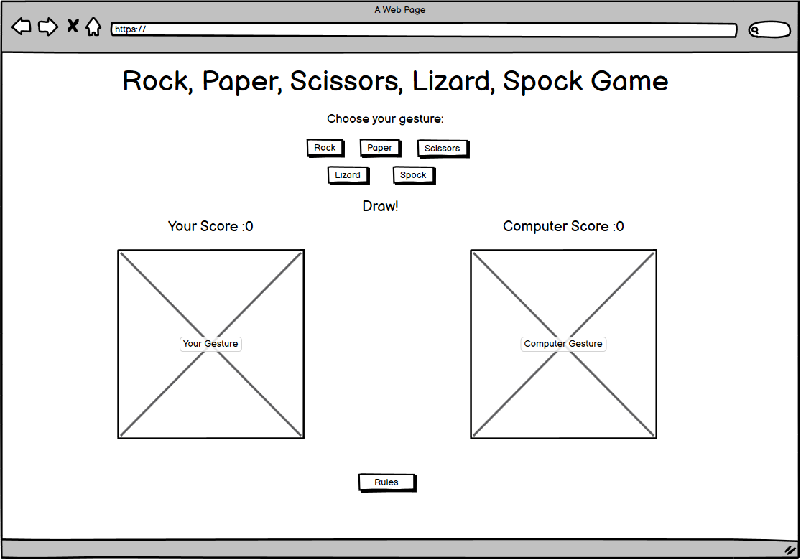

# [Rock Paper Scissors Lizard Spock](https://michalpokojny.github.io/MyProject2-RockPaperScissorsLizardSpock/)

Rock Paper Scissors Lizard Spock game is an intuitive game inspired by the Big Bang Theory comedy series.
The main purpose of this game is to have some fun trying to beat the Computer. 
It is targeted for adults as well as children. Users of this game can learn rules with the addition of two different gestures, lizard and Spock!

  

## User stories

- As a visiting user, I want to play a game of Rock Paper Scissors Lizard Spock, so I know how to play it.
- As a visiting user, I would like to spend some time playing some game so this Rock Paper Scissors Lizard Spock is perfect for relax.
- As a visiting user, I would like to learn the rules of the game, so I can play it with my friends.

## Features

**Heading**

  

 

- Heading of the game with the interactive word "Game" changing color every 2 seconds

**The header of the game**

  

 

- Header of the game where user can click and choose gesture he wants to play with.
- Buttons have a hover effect of changing background and text color on 
desktop and are active when clicked on the phone and tablet devices.

**Game section**

- The actual game section contains an image on the left and right.
- Once one of the buttons is clicked image for the player and based on the computer math result 
accurate images are assigned to the sections.
- Once one of the buttons is clicked, the score is updated based on the result of the game.

  

 

**Footer**

- The footer of the website is a button with hover effect changing size of the font for desktop devices or active effect  
for mobile and tablet devices.
- Once clicked, the Html list is shown with the rules of the game.
- When clicked again, the list is hidden.

Not clicked 
  

Clicked 
  

## Future features

- Upgrade this game with a reset button for resetting scores.
- Add different sections with different games to this webpage.

## Typography and color scheme

**Fonts**

- Fonts are taken from Google Fonts.
- A font named Roboto by Christian Robertson is used for this website.

  

 

**Colour**

- Colour pallet used for this website.

  

 

## Wireframes

Wireframe for phone device. 
  

 
 

Wireframe for tablet device. 
  

 
 

Wireframe for desktop device. 
  

 

## Technologies used

- Balsamiq - Wireframe planning.
- HTML5 - The main structure of the website.
- CSS3 - Styling of the website.
- Javascript - Website Interactive Part and changing DOM.
- GitPod - Workspace of the project.
- GitHub - Hosting the website.
- Grammarly - Grammar check of all the text on the website and readme file.
- Google Chrome - Main testing of the website on all devices.
- Google Chrome Lighthouse - Testing the performance of each page.

## Testing

- I tested this webpage on Google Chrome, Mozilla Firefox, and on Safari.
- I confirmed that this project is fully responsive, and works on every screen device using the dev tools device toolbar.

**Bugs**

-- No bugs made during the develop of the project

**Validator testing**

- HTML 
-- No errors were returned when passing through the official W3C validator.
- CSS
-- No errors were found when passing through the official validator.
- Accessibility
-- I confirmed that the images, colors, and fonts chosen are easy to read and accessible by running it through the Google Chrome lighthouse in devtools.
- Javascript 
-- No errors were found on [JShint](https://jshint.com/), only 1 warning for function playgame(); declared within loops referencing an outer scoped variable.

**Lighthouse testing**

Desktop  
  

 

Phone 
  

 

**Unfixed bugs**

No unfixed bugs

## Testing user stories

**Gesture button area**

- Expected
-- Feature is expected to clicked and sign the accurate image to player area based on user choice of gesture and also do the math random calculation for computer area and assign a accurate image and based on the result update the live score.

  

 

- Testing
-- Tested the feature by clicking one of the buttons.

- Result 
-- The feature responded as expected and assign the correct image and update the score.

  

 

**Rules button area**

- Expected
-- Feature is expected to be clicked when user want to see the rules of the game.

  

- Testing
-- Tested the feature by clicking the "Rules" button.

- Result 
-- The feature responded as expected and showed the unordered list area of the game rules.

  

## Deployment

- The site was deployed to GitHub pages. The steps to deploy are as follows:

  - In the GitHub repository, navigate to the Settings tab
  - From the source section drop-down menu, select the Master Branch
  - Once the Master Branch has been selected, the page will be automatically refreshed with a detailed ribbon display to indicate the successful deployment.

  The live link can be found here - https://michalpokojny.github.io/MyProject2/

  - The site can be also deployed on GitPod. The steps to deploy are as follows:
   - In the gitpod workspace go to MyProject1 click on the index.html
   - Once opened, in the terminal type: python3 -m http.server
   - Local link will appear in the terminal, click on it and the webpage will open in a new tab.

- To Fork this repositary:

  - Navigate to GitHub project repositary [Rock Paper Scissors Lizard Spock](https://michalpokojny.github.io/MyProject2-RockPaperScissorsLizardSpock/)
  - In the right hand corner see the "Fork" section and click on it.
  - Select an owner for the forked repository.
  - Click Create fork button.

## Credits

**Content**

- Some of the javascript code I got inspired from [w3schools](w3schools.com)
- Colours image taken from [Coolors](https://coolors.co/)
- Inspiration and some of the code of this game were taken from the [Love-Maths](https://github.com/Code-Institute-Solutions/love-maths-2.0-sourcecode) project at [Code Institute](https://codeinstitute.net/ie/)

**Media**

- All the images were taken from [imgbin](https://imgbin.com/)

## Acknowledgements

- First I would like to thank my partner Jane for her continuous support and for helping me with grammar checks and correct wording.
- I would like to also thank my mentor [Rohit Sharma](https://github.com/rohit0286) for the support in deploying my second project.
